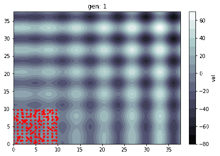

# Lamarck Optimizer: A Genetic Algorithm Prototype.

The Lamarck package is a simple optimization tool that operates by creating Populations of different solutions, running them through a specific Process (an user-defined function) and selecting, mixing and tweaking them to get to the best of a wide range of possibilities.

The Process must be a Python `function` with one or more input parameters and must return a `dict` of outputs. The Solution Space is defined by the "Genome Blueprint", which is a `dict` that determines how those **input parameters** ("genes") will configure a **solution** ("genome", "Creature") by specifying what are the ranges of those variables and how they behave.

##### Basic Flow

> ```raw
> Genome Blueprint --> Population --> Process --> Results --> Selection --> Cross-over --> Mutation
>                         ^                                                                   |
>                         +------(repeat)-----------------------------------------------------+
> ```

## Table Of Contents
1. [Features](#features)
1. [Examples](#examples)
    1. [Example 1 - Basic flow](#basic-flow-example)
    1. [Example 2 - Travelling Salesman Problem](#salesman-example)
    1. [Proof Of Concept - Local Maximum](#proof-of-concept)
1. [Simulation Configurations](#sim-configs)
1. [Genome Specifications](#genome-specifications)
1. [Defining the Process](#process-definition)
1. [Practical Requirements Summary](#req-summary)


<div id='features'/>

## Features
- Creation of **very diverse** Populations
- **Multiple types** of Input Variables (Genes)
    - **Numeric**
    - **Categorical**
    - **Vectorial**
    - **Boolean**
- **Versatile process modelling** (it's just a standard Python function)
- Optimization for **Single** or **Multiple Objectives**
- Simulation control
    - Maximum **number of Generations**
    - Maximum **Stall** (halt if the simulation is not finding better solutions)
    - **Multithreading**
    - **Mutation** proportion
    - **Selection** proportion
- **Reproduction** control
- **Constraint** addition
- **Visualization** Tools
    - Variable pair
    - Evolution of the solutions
    - Pareto fronts

<div id='examples'/>

## Examples <a name="examples"></a>

<div id='basic-flow-example'/>

### Example #1 - Simple optimization run <a name="basic-flow"></a>

```python
import numpy as np
from lamarck import BlueprintBuilder, Optimizer

# Defining the Process
def my_process(x, y):
    val = np.sin(x)*x + np.sin(y)*y
    return {'val': val}

# Building the Blueprint
builder = BlueprintBuilder()
# (note that 'x' and 'y' are declared, which are the exact same names as the parameters of the
# function 'my_process' - *this is required*)
builder.add_float_gene(name='x',
                       domain=(0, 12*np.pi))

builder.add_float_gene(name='y',
                       domain=(0, 12*np.pi))

blueprint = builder.get_blueprint()

# Building the Population (deterministically and randomly)
# Deterministic: will make a linearly spaced range of 20 values for both x and y genes
# 20 values, 2 genes: 20**2 = 400 Creatures
popdet = blueprint.populate.deterministic(n=20)
# Random: will make Creatures with Genes with random values (within its domains)
# n = 600: 600 Creatures
poprnd = blueprint.populate.random(n=600)
# Population will have 1000 Creatures (400 + 600)
pop = popdet + poprnd

# Setting up the Optimizer
opt = Optimizer(pop, my_process)

# Simulate (this will return an optimized population)
opt.simulate.single_criteria(output='val', objective='max')

# Check the best solution
print(opt.datasets.get_best_criature())
# x           33.008920
# y           33.023696
# val         66.001915
# Criteria    66.001915
# Rank         1.000000

# So it found x=33.01 and y=33.02 as the best Solution.
```

<div id='salesman-example'/>

### Basic Example #2 - Travelling Salesman
(Using the module from the `docs/examples` folder: *`toymodules/salesman.py`*)
```python
from toymodules.salesman import TravelSalesman
from lamarck import BlueprintBuilder, Optimizer

builder = BlueprintBuilder()

# Defining the Process
# In order to persist the TravelSalesman object for the Process, we need to wrap it in a function
def process_deco(travel_salesman):
    def wrapper(route):
        distance = travel_salesman.get_route_distance(route)
        return {'distance': distance}
    return wrapper

# Genome Blueprint
# (this will only have one variable that is a "Set" of the particular order of cities that the
# salesman should vist)
number_of_cities = 20
cities = tuple(range(number_of_cities))
builder.add_set_gene(name='route',
                     domain=cities,
                     length=number_of_cities)

# Creating the Population (5000 randomly generated routes)
blueprint = builder.get_blueprint()
pop = blueprint.populate.random(n=5000)

# Checking the cities "map"
trav_salesman = TravelSalesman(number_of_cities, seed=123)
trav_salesman.plot()
```


```python
# Setting up the Process
process = process_deco(trav_salesman)

# Setting up the Optimizer
opt = Optimizer(population=pop, process=process)

# Activate MultiThreading (for better performance)
opt.config.multithread = True

# peek best solution during runtime
opt.config.peek_champion_variables = ['route', 'distance']
```
##### - "Light" Simulation:
```python
# Simulate
opt.config.max_generations = 5
opt.simulate.single_criteria(output='distance', objective='min')

# Lets check this route
best_creature = opt.datasets.get_best_criature()
best_route = best_creature['route']
trav_salesman.plot_route(best_route)
```


##### - "Heavier" Simulation:
```python
# Now lets amp up the number of generations
opt.config.max_generations = 40
opt.config.max_stall = 10
opt.simulate.single_criteria(output='distance', objective='min')

# Lets check this route
best_creature = opt.datasets.get_best_criature()
best_route = best_creature['route']
trav_salesman.plot_route(best_route)
```


```python
# So The best Sequence it found (minimum 'distance' travelled) is:
# (9, 18, 3, 0, 6, 16, 12, 7, 13, 11, 15, 10, 5, 8, 14, 2, 17, 4, 19, 1)

# Just so you know, there are 1.216.451.004.088.320.000 different Routes in this problem (of 20
# cities that are all interconnected), so the ABSOLUTE BEST solution is REALLY HARD to find but
# the algorithm will get very close very fast
```
###### Evolution of the Species:


<div id='proof-of-concept'/>

### Proof Of Concept - Local Maximum
```python
import numpy as np
from matplotlib import pyplot as plt
from lamarck import Optimizer, BlueprintBuilder, HistoryExplorer

def process(x, y):
    val = np.sin(x)*x + np.sin(y)*y
    return {'val': val}

# Checking the solution space...
maxrange = 12
x = np.linspace(0, maxrange*np.pi, 100)
y = np.linspace(0, maxrange*np.pi, 100)
Xi, Yi = np.meshgrid(x, y)
Z = process(Xi, Yi)['val']

fig, ax = plt.subplots(constrained_layout=True)
CS = ax.contourf(x, y, Z, 15, cmap=plt.cm.bone)
cbar = fig.colorbar(CS)
ax = cbar.ax.set_ylabel('val')
```


```python
# Genome Creation
builder = BlueprintBuilder()
builder.add_float_gene(name='x',
                       domain=(0, maxrange*np.pi))
builder.add_float_gene(name='y',
                       domain=(0, maxrange*np.pi))
blueprint = builder.get_blueprint()

# Population
pop = blueprint.populate.deterministic(20) + blueprint.populate.random(600)
opt = Optimizer(pop, process)

# Create Optimizer
opt = Optimizer(population=pop, process=process) 

# Populated solution space:
```


```python
# simulate
opt.simulate.single_criteria(output='val', objective='max')

# Evolution of the Species:
```


#### Starting away from optimum space:
```python
constraint = lambda x, y: (x < 10) & (y < 10)
blueprint.add_constraint(constraint)

new_pop = blueprint.populate.deterministic(20) + blueprint.populate.random(600)
```

##### Simulating WITHOUT MUTATION
```python
opt = Optimizer(new_pop, process)
opt.config.p_mutation = 0
opt.simulate.single_criteria(output='val', objective='max')
```


###### Creatures get stuck in a local maximum

##### Simulating WITH MUTATION
```python
opt.config.p_mutation = 0.1
opt.simulate.single_criteria(output='val', objective='max')
```


###### Creatures now gravitate towards the global maximum

#### What if there's a gap between the global optimum and the starting area?
```python
def new_process(x, y):
    if not (((x < 10) & (y < 10)) | ((x > 30) & (y > 30))):
        val = -80
    else:
        val = process(x, y)['val']
    return {'val': val}

opt = Optimizer(new_pop, new_process)
opt.simulate.single_criteria(output='val', objective='max', quiet=True)
```


###### Creatures can't reach the best solution because only one gene is mutated

###### ... so we need to mutate both 'x' and 'y' genes. We do that just by changing the 'max_mutated_genes' config:
```python
opt.config.max_mutated_genes = 2
opt.simulate.single_criteria(output='val', objective='max', quiet=True)
```


###### Now the simulation eventually reaches the other area and finds the global max =)


But it is important to notice that mutating 2 genes here meant that **ALL genes were mutated**, which means that those mutations were basically creating new **complete random Genomes**, which is not necessarily a very efficient approach (specially with higher amounts of genes), although, as just shown, it CAN sometimes work just fine.

There is acually a dedicated configuration for generating a proportion of completely random Creatures between Generations, which is:

```python
# Example: setting it to 10%...
opt.config.p_new_random = 0.1 # default value is 0.
```

There is another option to make this simulation converge to the global maximum, which is to **allow some of the weaker Creatures** to reproduce, which will **increase the level of diversity** within the population, making some new kind of combinations possible without having to appeal to a completely randomized Creature making. This is possible by changing this configuration:

```python
# Example: setting it to 15%...
opt.config.p_selection_weak = 0.15 # default value is 0.
```

Using the following configuration, a similar behavior occurs, and new diverse Creatures produced by supposedly "weak" parents are the ones responsible for providing the variety that is necessary to reach new (and, in that case, better) areas of solutions.

```python
opt.config.p_selection = 0.3
opt.config.p_selection_weak = 0.2 # now 20% of the selected Creatures come from the "weak" slice
opt.config.max_mutated_genes = 1 # back to 1 mutation (which previously didn't work)

# Needed to amp those up because this solution has a slower convergence rate
opt.config.max_generations = 40
opt.config.max_stall = 15
```


This demonstrates how diversity effectively improves the Population and helps a better exploring of the solution space.

This method in particular takes more Generations to find the best solutions, but it shows how a **well-balanced variety of different methods of diversifying the Population** surely will **improve the Optimization process** both in terms of **quality and performance**.

##

##### For more detail on those examples, check out the `docs/examples` directory.


<div id='sim-configs'/>

## Simulation Configs
###### Default values:
```python
max_generations: int = 20 # maximum number of Generations
max_stall: int = 5 # How many times the simulation will run with no new best Creature
p_selection: float = 0.5 # Proportion of the Fittest that will survive to the next Generation
p_selection_weak: float = 0. # Proportion of the Weaker that will survive to the next Generation
randomize_to_fill_pop: bool = False # Generates new random Creatures if new ones are not unique
n_dispute: int = 2 # How many Creatures will be randomly selected to dispute for each Parent spot
n_parents: int = 2 # Amount of Parents that will provide genomes to mix and form a new Creature
children_per_relation: int = 2 # How many children the same group of parents will generate
p_mutation: float = 0.1 # Proportion of New Population that will be generated by Mutation
p_new_random: float = 0. # Proportion of New Population that will be generated Randomly
max_mutated_genes: int = 1 # Maximum amount of genes the can mutate
children_per_mutation: int = 1 # How many children the same Creature will generate by Mutating
multithread: bool = True # Using Multithread to simulate multiple Creatures concurrently
max_workers: int | None = None # Multithread Workers
peek_champion_variables: list | None = None # Select some variables to show during
```


<div id='genome-specifications'/>

## Genome Specifications

1. Scalar

    1. Integer
        1. Name: `str`
        2. Domain: `list or tuple: [min, max] or (min, max)`

    2. Float
        1. Name: `str`
        2. Domain: `list or tuple: [min, max] or (min, max)`

    3. Categorical
        1. Name: `str`
        2. Domain: `list or tuple`
    
    4. Boolean
        1. Name: `str`
>

2. Vectorial
    
    1. Array
        1. Name: `str`
        2. Domain: `list or tuple`
        3. Length: `int`
    
    1. Set
        1. Name: `str`
        2. Domain: `list or tuple`
        3. Length: `int`

#### Genome Example
```python
from lamarck import Blueprint

genome_blueprint_dict = {
    'num_var_int': {
        'type': 'integer',
        'domain':  (0, 10) # [min, max]
    },
    'num_var_float': {
        'type': 'float',
        'domain':  (2.5, 7.5) # [min, max]
    },
    'cat_var': {
        'type': 'categorical',
        'domain': ('A', 'B', 'C', 'D', 'E'),
    },
    'vec_var': {
        'type': 'set',
        'domain': (0, 1, 2, 3, 4, 5),
        'length': 3, # lenght CANNOT be greater than the domain's length
    },
    'vec_var_replace': {
        'type': 'array',
        'domain': ('i', 'j', 'k'),
        'length': 5, # lenght CAN be greater than the domain's length because of the replacement
    },
    'bool_var': {
        'type': 'boolean',
    }
}

blueprint = Blueprint(genome_blueprint_dict)
```
##### Using the BlueprintBuilder to assist the creation of this (fairly complicated) object:
```python
from lamarck import BlueprintBuilder

builder = BlueprintBuilder()

# num_var_int
builder.add_integer_gene(name='num_var_int',
                         domain=(0, 10))

# num_var_float
builder.add_float_gene(name='num_var_float',
                       domain=(2.5, 7.5))

# cat_var
builder.add_categorical_gene(name='cat_var',
                             domain=('A', 'B', 'C', 'D', 'E'))

# vec_var
builder.add_set_gene(name='vec_var',
                     domain=(0, 1, 2, 3, 4, 5),
                     length=3)

# vec_var_replace
builder.add_array_gene(name='vec_var_replace',
                       domain=('i', 'j', 'k'),
                       length=5)

# bool_var
builder.add_bool_gene(name='bool_var')

# generate blueprint
blueprint = builder.get_blueprint()
```


<div id='process-definition'/>

## Defining the process
This genome blueprint will help build the population with multiple values for the variables `num_var_int`, `num_var_float`, `cat_var`, `vec_var`, `vec_var_replace` and `bool_var`.

In this case, the `Process` must be a `Function` that has those variables as parameters and the output MUST ALWAYS be a `dict` with all the desired outputs.

Also, it is important that all the outputs are defined **within the function and NOT within the output `dict`**. The reason for this is that in order to get the *outputs*'s names, the algorithm will look for them in the function's `__code__.co_consts` and it **may** create a **problem** with its ordering. 

- Example of a **VALID** process output:
```python
def some_process(num_var_int, num_var_float, cat_var, vec_var, vec_var_replace, bool_var):
    out1 = func1(num_var_int, num_var_float)
    if bool_var:
        out2 = func2(cat_var, vec_var_replace)
    else:
        out2 = func3(cat_var, vec_var)
    return {'output_1': out1, 'output_2': out2}
```

- Example of a **PROBLEMATIC** process output (**may work but avoid doing this**):
```python
def some_process(num_var_int, num_var_float, cat_var, vec_var, vec_var_replace, bool_var):
    return {
        'output_1': func1(num_var_int, num_var_float),
        'output_2': func2(cat_var, vec_var_replace) if bool_var else func3(cat_var, vec_var)
    }
```


<div id='req-summary'/>

## Summary of all practical Requirements

1. The Process's parameters must have the same names as the Genes.
> ```python
> def proc(x, y, z):
>        ...
>
> blueprint_dict = {
>     'x': {...},
>     'y': {...},
>     'z': {...},
> }
> ```

2. The Process must return a dictionary with already set variables.
> ```python
> def proc(x, y, z):
>     ...
>     return {'output': some_variable, 'other_output': another_variable}
> ```

3. The Proportions `p_selection`, `p_selection_weak`, `p_mutation` and `p_new_random` are all absolute, so...
    - `(p_selection + p_selection_weak + p_mutation + p_new_random) < 1`
    - The proportion of the Population generated by Sexual Reproduction is
        `1 - p_selection - p_selection_weak - p_mutation - p_new_random`

> ```python
> # Example - population of 1000 Creatures
> 
> # Selecting 40% of the population ordered by most to least fit
> p_selection = 0.4 # 400 of the fittest Creatures will fight to generate offspring
> 
> # Adding some of the weaker (randomly) to reproduce/mutate
> p_selection_weak = 0.05 # 50 of the weaker Creatures will also fight to generate offspring
> 
> # Mutating 10% and randomizing 15% (OF 1000 CREATURES)
> p_mutation = 0.1 # 100 Creatures will be generated by Mutation
> p_new_random = 0.15 # 150 Creatures will be generated randomly
> 
> # Adding all up...
> 
> # 450 Creatures were selected
> # 550 Creatures were eliminated
> 
> # 550 new Creatures will be generated by those selected ones
> # 100 Creatues will be Generated by mutation (asexual reproduction)
> # 150 Creatures will be generated randomly
> 
> # 550 - 100 - 150 = 300
> 
> # 300 will be generated by crossing genes (sexual reproduction)
> ```
