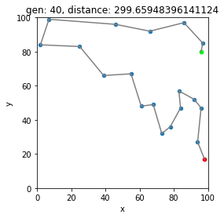

# Lamarck Optimizer: A Genetic Algorithm Prototype.

The Lamarck package is a simple optimization tool that operates by creating Populations of different solutions, running them through a specific Process (an user-defined function) and selecting, mixing and tweaking them to get to the best of a wide range of possibilities.

The Process must be a Python `function` with one or more input parameters and must return a `dict` of outputs. The Solution Space is defined by the "Genome Blueprint", which is a `dict` that determines how those input parameters (genes) will configure a solution (genome) by specifying what are the ranges of those variables and how they behave.

##### Basic Flow

> ```raw
> Genome Blueprint --> Population --> Process --> Results --> Selection --> Mutation
>                         ^                                                      |
>                         +--(repeat)--------------------------------------------+
> ```

## Features
- Creation of **very diverse** Populations
- **Multiple types** of Input Variables (Genes)
    - **Numeric**
    - **Categorical**
    - **Vectorial**
    - **Boolean**
- **Versatile process modelling** (it's just a standard Python function)
- Optimization for **Single** or **Multiple Objectives**
- Simulation control
    - Maximum **number of Generations**
    - Maximum **Stall** (halt if the simulation is not finding better solutions)
    - **Multithreading**
    - **Mutation** probability
    - **Selection** proportion
- **Reproduction** control
- **Constraint** addition
- **Visualization** Tools
    - Variable pair
    - Evolution of the solutions
    - Pareto fronts

## Examples
### Basic Example #1

```python
import numpy as np
from lamarck import BlueprintBuilder, Optimizer

# Defining the Process
def my_process(x, y):
    val = np.sin(x)*x + np.sin(y)*y
    return {'val': val}

# Building the Blueprint
builder = BlueprintBuilder()
# (note that 'x' and 'y' are declared, which are the exact same names as the
# parameters of the function 'my_process' - *this is required*)
builder.add_float_gene(name='x',
                       domain=(0, 12*np.pi))

builder.add_float_gene(name='y',
                       domain=(0, 12*np.pi))

blueprint = builder.get_blueprint()

# Building the Population
popdet = blueprint.populate.deterministic(n=20)
poprnd = blueprint.populate.random(n=600)
pop = popdet + poprnd

# Setting up the Optimizer
opt = Optimizer(pop, my_process)

# Simulate (this will return an optimized population)
opt.simulate.single_criteria(output='val', objective='max')

# Check the best solution
print(opt.datasets.get_best_criature())
# x           33.008920
# y           33.023696
# val         66.001915
# Criteria    66.001915
# Rank         1.000000

# So it found x=33.01 and y=33.02 as the best Solution.
```

### Basic Example #2 - Travelling Salesman
(Using the module from the `examples` folder: *`docs/examples/toymodules/salesman.py`*)
```python
from toymodules.salesman import TravelSalesman
from lamarck import BlueprintBuilder, Optimizer

builder = BlueprintBuilder()

# Defining the Process
# In order to persist the TravelSalesman object for the Process, we need to
# wrap it in a function
def process_deco(travel_salesman):
    def wrapper(route):
        return {'distance': travel_salesman.get_route_distance(route)}
    return wrapper

# Genome Blueprint
# (this will only have one variable that is a "Vector" of the particular order
# of cities that the salesman should vist)
number_of_cities = 20
cities = tuple(range(number_of_cities))
builder.add_set_gene(name='route',
                     domain=cities,
                     length=number_of_cities)

# Creating the Population (5000 randomly generated 'route's)
blueprint = builder.get_blueprint()
pop = blueprint.populate.random(n=5000)

# Checking the cities "map"
trav_salesman = TravelSalesman(number_of_cities, seed=123)
trav_salesman.plot()
```

```python
# Setting up the Process
process = process_deco(trav_salesman)

# Setting up the Optimizer
opt = Optimizer(population=pop, process=process)

# Activate MultiThreading (for better performance)
opt.config.multithread = True

# peek best solution during runtime
opt.config.peek_champion_variables = ['route', 'distance']
```
##### - "Light" Simulation:
```python
# Simulate (this will return an optimized population)
opt.config.max_generations = 5
opt.simulate.single_criteria(output='distance', objective='min')

# Lets check this route
best_creature = opt.datasets.get_best_criature()
best_route = best_creature['route']
trav_salesman.plot_route(best_route)
```


##### - "Heavier" Simulation:
```python
# Now lets amp up the number of generations
opt.config.max_generations = 40
opt.config.max_stall = 10
opt.simulate.single_criteria(output='distance', objective='min')

# Lets check this route
best_creature = opt.datasets.get_best_criature()
best_route = best_creature['route']
trav_salesman.plot_route(best_route)
```


```python
# So The best Sequence it found (minimum 'distance' travelled) is:
# (1, 19, 5, 8, 15, 10, 14, 4, 17, 2, 9, 18, 3, 0, 6, 11, 13, 7, 16, 12)

# Just so you know, there are 1.216.451.004.088.320.000 different Routes in
# this problem (of 20 cities that are all interconnected), so THE best solution
# is REALLY HARD to find but the algorithm will get very close very fast


# Evolution of the Species:
```


### Basic Example #3 - Local Maximum
```python
import numpy as np
from matplotlib import pyplot as plt
from lamarck import Optimizer, BlueprintBuilder, HistoryExplorer

def process(x, y):
    val = np.sin(x)*x + np.sin(y)*y
    return {'val': val}

maxrange = 12
x = np.linspace(0, maxrange*np.pi, 100)
y = np.linspace(0, maxrange*np.pi, 100)
Xi, Yi = np.meshgrid(x, y)
Z = process(Xi, Yi)['val']

fig, ax = plt.subplots(constrained_layout=True)
CS = ax.contourf(x, y, Z, 15, cmap=plt.cm.bone)
cbar = fig.colorbar(CS)
ax = cbar.ax.set_ylabel('val')
```


```python
# Genome Creation
builder = BlueprintBuilder()
builder.add_float_gene(name='x',
                       domain=(0, maxrange*np.pi))
builder.add_float_gene(name='y',
                       domain=(0, maxrange*np.pi))
blueprint = builder.get_blueprint()

# Population
pop = blueprint.populate.deterministic(20) + blueprint.populate.random(600)
opt = Optimizer(pop, process)

# Create Optimizer
opt = Optimizer(population=pop, process=process) 

# Explore variable space
```


```python
# simulate
opt.simulate.single_criteria(output='val', objective='max', quiet=True)

# Evolution of the Species:
```


#### -- Starting away from optimum space:
```python
new_range = 3

builder = BlueprintBuilder()

builder.add_float_gene(name='x',
                       domain=(0, new_range*np.pi))

builder.add_float_gene(name='y',
                       domain=(0, new_range*np.pi))

blueprint = builder.get_blueprint()

new_pop = blueprint.populate.deterministic(20) + blueprint.populate.random(600)
```

#### Simulating WITHOUT MUTATION
```python
opt = Optimizer(new_pop, process)
opt.config.p_mutation = 0
opt.simulate.single_criteria(output='val', objective='max', quiet=True)

# Evolution: (Creatures get stuck in a local maximum)
```


#### Simulating WITH MUTATION
```python
opt = Optimizer(new_pop, process)
opt.config.p_mutation = 0.1
opt.simulate.single_criteria(output='val', objective='max', quiet=True)

# Evolution: (Creatures now gravitate to the global maximum)
```


### Simulation Configs

### Genome Specifications

1. Scalar

    1. Integer
        1. Name: `str`
        2. Domain: `list or tuple: [min, max] or (min, max)`

    2. Float
        1. Name: `str`
        2. Domain: `list or tuple: [min, max] or (min, max)`

    3. Categorical
        1. Name: `str`
        2. Domain: `list or tuple`
    
    4. Boolean
        1. Name: `str`
>

2. Vectorial
    
    1. Array
        1. Name: `str`
        2. Domain: `list or tuple`
        3. Length: `int`
    
    1. Set
        1. Name: `str`
        2. Domain: `list or tuple`
        3. Length: `int`

#### Genome Example
```python
from lamarck import Blueprint

genome_blueprint_dict = {
    'num_var': {
        'type': 'integer',
        'domain':  (0, 10) # [min, max]
    },
    'cat_var': {
        'type': 'categorical',
        'domain': ('A', 'B', 'C', 'D', 'E'),
    },
    'vec_var': {
        'type': 'set',
        'domain': (0, 1, 2, 3, 4, 5),
        'length': 3, # lenght CANNOT be greater than the domain's length
    },
    'vec_var_replace': {
        'type': 'array',
        'domain': ('i', 'j', 'k'),
        'length': 5, # lenght CAN be greater than the domain's length because of the replacement
    },
    'bool_var': {
        'type': 'boolean',
    }
}

blueprint = Blueprint(genome_blueprint_dict)

# This genome blueprint will help build the population with multiple values for
# the variables `num_var`, `cat_var`, `vec_var`, `vec_var_replace` and `bool_var`

# In this case, the "Process" must be a Function that has those variables as
# parameters and the output MUST ALWAYS be a `dict` with all the desired
# outputs.
def some_process(num_var, cat_var, vec_var, vec_var_replace, bool_var):
    return {'output_1': ...}
```

##### For more examples and use cases, check out the `docs/examples` directory.

